# 递归自我改进的两条路：Dream-RSI 与 RRSI

> 两篇 2026 年 9 月 Google 系论文精读
>
> Dream-RSI：arXiv 2609.14858 ｜ RRSI：arXiv 2609.24972 

今天分享两篇这个月先后挂出来的论文，都出自 Google 团队，两篇论文都围绕着 recursive self-improvement 这一主题，但切入点和要解决的问题不同。第一篇 Dream-RSI 问的是：RSI 的发现循环里，**探索策略本身怎么改进**。该论文把已经走过的路变成一个可回放的模拟器，让 agent 在"梦里"便宜地试错。第二篇 RRSI 问的更根本：当 agent harness 在一个固定基准上反复自我修改时，这种进化其实在**过拟合**——他们把经典统计学习里的正则化搬过来，管住这个进化过程。一个解决"改进的反馈从哪来"，一个解决"改进是否可泛化"。

---

## Dream-RSI：把发现历史变成模拟器

### 动机：meta 层的反馈又慢又贵

先说背景。AlphaEvolve 这类 LLM 驱动的发现系统，跑的都是同一个循环：生成候选、跑评测、带着反馈改、再生成。随着目标变难，这个循环要跑成千上万次 proposal–evaluation，算力怎么花就成了调度问题——哪些分支值得展开、开多少路并行、什么时候停。现有系统基本靠手工设计的固定策略，跑一万轮也不会从自己的历史里学到任何东西。

那能不能在线优化这个探索策略？听着自然，但有两个结构性困难。第一，**meta 层面的反馈又慢又贵**：评估一个候选解只需要跑一次，评估一个"探索策略"却要等它主导的整个发现过程走完，动辄上百次调用之后才知道好坏。第二，meta 策略空间巨大，新提出的策略大概率不行，你得试很多个。两个因素一叠，在线试错基本不可行。

论文的关键洞察出人意料地简单：**完整的发现历史本身就是一个模拟器**。每次尝试的执行结果都被记下来了，组织成一棵 discovery tree 之后，任何一个备选策略都可以"重放"这棵树——选不同的分支、不同的顺序、不同的并行度、不同的停止点，所有结果都是现成的，读出来就行，不用真的重跑 agent。他们把这叫 replay simulator，也直接叫 world，类比的是 Dreamer 那一族 model-based RL：在想象中训练策略，再部署回真实环境。

### 方法：三阶段闭环与 replay 评分（2:30 – 5:30）

> **切图 · Figure 1（原文 p.2）**：先讲三个阶段形成闭环，再用右下角 Zoom-in 框讲 dreaming 的内部细节。

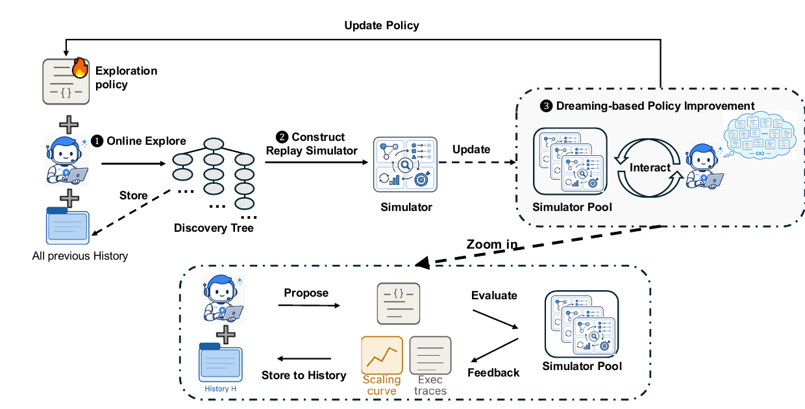

*Figure 1 · 原文 p.2 —— 系统总览：① Online Explore 由当前探索策略指挥固定的 coding agent 扩展 discovery tree；② 把树转成可复用的 replay simulator 池；③ Dreaming-based Policy Improvement——下方 Zoom-in 框展示 agent 在"脑内"批量提出候选策略、送入模拟器评估、凭反馈迭代。*

整体框架分三个阶段，形成闭环。第一阶段 Online Explore：当前探索策略指挥一个**固定的** coding agent 做真实发现，每个节点——也就是每次尝试——连同 workspace 快照、产出、评测诊断和得分一起存进树里。第二阶段，把树变成可复用的模拟器池。第三阶段就是图右上的 dreaming：在模拟器里大批量评估候选策略，改出更好的版本，再部署回去开始下一轮。

> **切图 · Figure 2（原文 p.4）**：强调"一次昂贵在线运行 → 成千上万次零成本离线评估"这个杠杆。

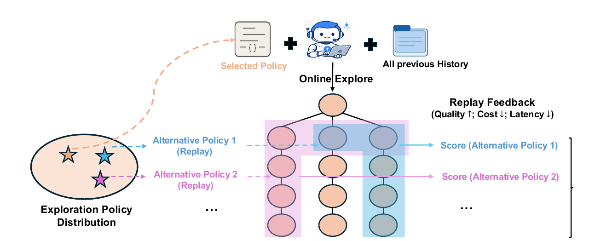

*Figure 2 · 原文 p.4 —— 发现历史作为 replay simulator：左侧是探索策略分布，中间是已记录的 discovery tree，备选策略 1/2 以不同方式重放树的不同子集，右侧直接读出各自的质量、成本与延迟反馈。*

Figure 2 画的就是核心机制：一次昂贵的在线运行，换来的是之后成千上万次**零执行成本**的 off-policy 评估。

技术上有三个设计值得留意。首先是决策接口，在线和离线共用同一套：策略观察当前已揭示的树，每轮选一批节点——不超过 W 个并行 worker——每个被选中的节点派一个 worker 去扩展。区别只在转移函数：在线阶段是真实的生成-评测，带随机性；replay 阶段是**确定性地揭示已记录的子节点**，不产生任何树外的新结果。这个统一接口是整个框架能"离线评估在线策略"的前提。

第二是 replay 的评分函数，公式 (1)，三项：发现质量，取回放轨迹里见过的最高节点分；减去执行成本，按回放所代表的生成-评测请求数计罚；再加一个并行度奖励，奖励每轮批量塞进更多有用尝试的策略。也就是说它偏好的不只是"能找到好解的策略"，还有"花得少、并行度高"的策略。

第三是策略改进怎么闭环。一个固定的 LLM policy-development agent 拿到回放轨迹和分数，分析哪些决策成功了、哪些反复失败，然后**直接修改探索策略的代码**，产出 M 个版本，全部在同一批历史上评估，选平均回放分最高的部署。候选集里包含当前策略，所以这个选择在回放分数上是单调不退的——一个很保守但稳的设计。整个系统里，底下的发现 agent、评测器、执行接口全部冻结，动的只有探索策略这一层。

### 实验：三个域，两种获胜模式（5:30 – 8:00）

实验横跨算法工程、数学优化和 GPU kernel 三个域。对照组统一是 Recursive Fixed Exploration：同样的 agent、评测器、初始策略和预算，唯一区别是策略永远不变。

> **切图 · Figure 3（原文 p.8）**：先讲 (a) 表格的两组数字对比，再指 (b) 图里两条轨迹从第 2 轮开始的分叉。

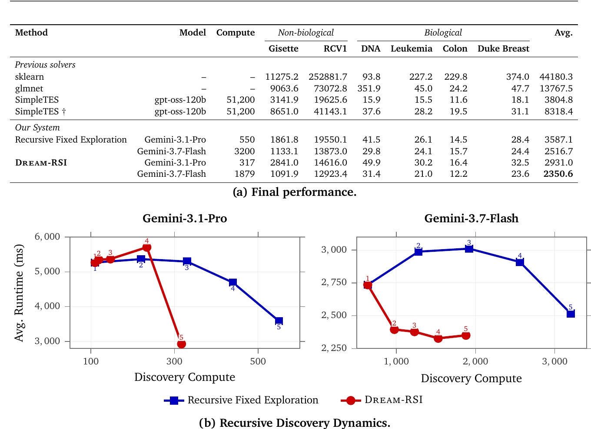

*Figure 3 · 原文 p.8 —— Lasso 正则路径求解结果。(a) 六个 held-out 数据集上的最终运行时，Compute 为 discovery-agent 调用数；(b) 两个 backbone 下平均运行时随累计算力的递归动态，标注数字为递归轮次。*

先看算法工程，任务是 Lasso 正则路径求解。表格里两组数：用 Gemini 3.1 Pro，Dream-RSI 只花 317 次调用，六个 held-out 数据集平均 2931 毫秒；固定探索花 550 次调用只做到 3587 毫秒——又快又省。对 SimpleTES 更是两个数量级的调用差距：对方报了 51200 代，这里不到两千次调用就把平均运行时压到 2350 到 2931 毫秒，同时全面好于 sklearn 和 glmnet。一个有意思的观察：两个 backbone 学出的解风格不同，3.1 Pro 的解特别擅长 RCV1 这类大规模矩阵，Flash 的解更均衡通用。(b) 图里两条轨迹从第二轮起明显分叉——这正是策略改进开始起作用的时刻，因为第一轮两家共享同一个初始策略。

> **切图 · Table 1（原文 p.9）**：只点 Sum-Diff 一列的 1.145427 和 Circle Packing 打平即可，别逐行念。

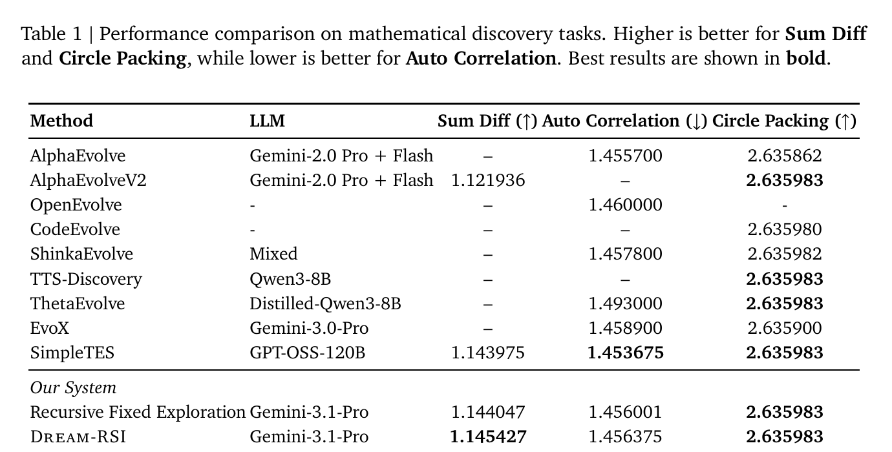

*Table 1 · 原文 p.9 —— 三个数学发现任务上与 AlphaEvolve、SimpleTES、ThetaEvolve 等系统的对比；Sum Diff 与 Circle Packing 越高越好，Auto Correlation 越低越好，最优加粗。*

数学优化这边，Sum-Difference 拿到 1.145427，超过包括 SimpleTES 在内的所有对比系统；Circle Packing 打平最强 reported 结果；Autocorrelation 上 SimpleTES 仍是 SOTA，但它花了 51200 代，这里不到一千代就到 1.456375。这组实验的重点不在刷绝对记录，而在展示方法能跨问题类型迁移——离散组合、几何、泛函优化，同一套循环不用改。

> **切图 · Figure 4（原文 p.10）**：指出四个子图对应两种获胜模式：省预算 vs 同预算更高分。

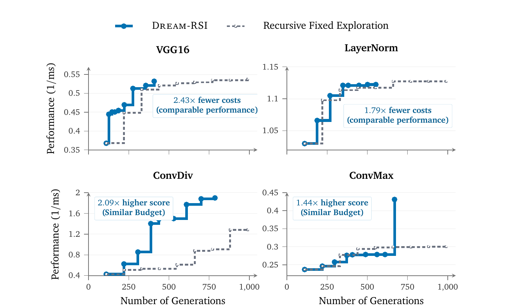

*Figure 4 · 原文 p.10 —— KernelBench 四个任务的发现轨迹。VGG16 / LayerNorm：以 2.43× / 1.79× 更少生成数达到相当性能；ConvDiv / ConvMax：同等预算下性能高 2.09× / 1.44×。*

GPU kernel 上是两种获胜模式各占一半：VGG16 和 LayerNorm 上，用 2.43 倍和 1.79 倍少的生成次数达到相当性能；ConvDiv 和 ConvMax 上，同等预算下性能直接高出 2.09 倍和 1.44 倍。

分析部分有两个实验，我认为比主结果更有信息量。第一个：一个自然的替代设计是把历史抽象成高层"方向性 insights"塞进 prompt——这也是大多数 memory 类工作的做法。结果论文发现，无论固定探索还是 Dream-RSI，**加上这种语义引导都一致变差**（Figure 5，口播带过，不切图）。作者的解释是，长视界发现里强行施加语义偏置会过早收窄搜索空间。这其实是在说：把历史当"可交互的模拟器"和把历史当"经验总结"，是两种本质不同的用法，后者在这个场景里是有害的。

第二个看策略行为本身。下图是 ConvDiv 任务上学到的策略在九轮递归中的演化。

> **切图 · Figure 6（原文 p.11）**：上：round-best 性能一路从 0.427 涨到 1.898；下：每轮评估次数在 110 → 50 → 回升之间摆动。两图对照讲"省算力—再投入"的自适应节律。

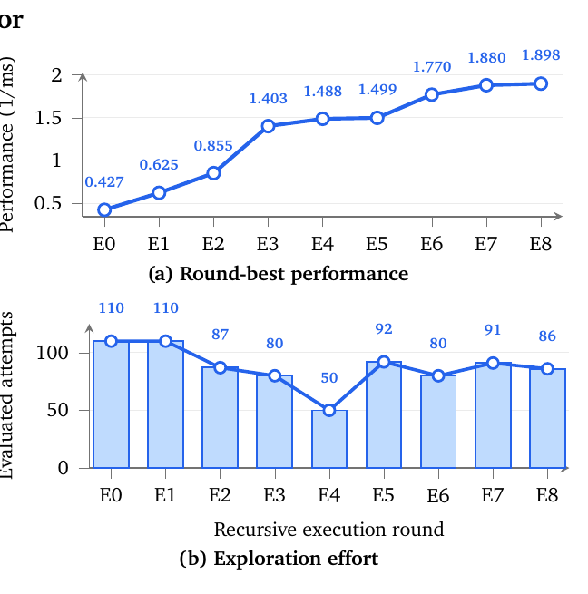

*Figure 6 · 原文 p.11 —— ConvDiv 上探索行为的演化。(a) 各轮最佳性能；(b) 各轮被评估的尝试次数。性能爬升期策略主动收缩算力（110→50），停滞期重新加大投入（92），随后性能继续上涨。*

上半图性能一路从 0.427 涨到 1.898；下半图是每轮的评估次数——开局 110，性能爬升期主动砍到 50，平台上不去之后又加回 92，随后性能继续涨。这说明 replay 反馈真的在塑造策略的算力分配行为，呈现明显的"省着花、再投入"节律，而不是碰巧赢了。

### 局限：模拟器的天花板（8:00 – 9:00）

这篇没有写 limitation 章节，我读下来有这么几点要打问号。最核心的：**replay 的评估范围被锁死在已观测的树内**。策略只能重排已经走过的路，永远无法评估"去没探索过的地方探索"的策略——模拟器的价值随树的质量封顶，探索-利用的老问题在 meta 层依然存在，只是被推后了一层。其次，回放分数本质上也是在有限历史集合上反复评估选优的，论文对这一层自身的过拟合风险没有讨论——这一点请记住，讲第二篇的时候会呼应。另外评分函数里的 β 系数、回放深度 K2 这些超参都是手工设定的，没有给敏感性分析。最后，所有任务都处在"评测信号便宜且可靠"的域里，评测昂贵或带噪声的场景这个循环转不转，是未知数。

---

## Part II · RRSI：给 harness 进化加上正则化（9:00 – 16:00）

### 动机：进化在过拟合（9:00 – 10:30）

第二篇把镜头拉近一层。现在的 LLM agent 是"冻结的模型 + harness"：prompt、控制流、工具接口、记忆、上下文管理。大量产品进展来自 harness 工程而不是新权重，于是自然有人用 LLM 自动进化 harness——这就是 agent 系统层面的 RSI。

但这里有个最近被反复证实的坑：进化时反复用同一个有限的评测集，构成 adaptive data analysis——Dwork 等人 2015 年就讲过，自适应地重复使用 holdout 会泄露信息。结果是 evolve 集涨分，迁移到没见过的 benchmark 上增益缩水甚至消失。论文把失败模式归成三类：**benchmark-specific fitting**，把特定基准的模式写死进 harness；**noise chasing**，把评测噪声当成真增益固化下来；还有 **complexity accumulation**，只涨分不涨机制、越改越臃肿。

> **切图 · Figure 1（原文 p.2）**：先指 (a) 散点图——多数方法落在"增益不迁移"红区；再扫 (b)–(d) 三张柱状图：蓝色 RRSI 柱全面高于灰色基线。

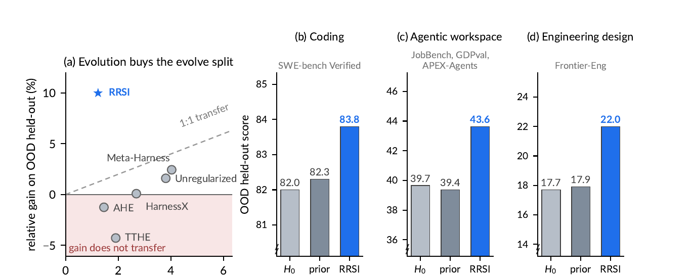

*Figure 1 · 原文 p.2 —— (a) 各方法在 evolve split 与 OOD 上的相对增益：参考线为 1:1 迁移，多数先前方法落在"增益不迁移"区域，TTHE 甚至为负；(b)–(d) 初始 harness H0、先前方法均值与 RRSI 在三个域 OOD 测试上的得分。*

Figure 1(a) 画得很直白：横轴是 evolve split 上的增益，纵轴是 OOD 上的增益，虚线是 1:1 迁移。几个 harness 进化方法的点几乎全在斜率之下，好几个落在"增益不迁移"的红区里，TTHE 收盘甚至是负的。右面三张柱状图是改进后的结果——这个我们一会儿回来看。

### 方法：正则化搜索轨迹，而不是限制编辑空间（10:30 – 13:00）

> **切图 · Figure 2（原文 p.4）**：左（proposal 侧 A/B/C）到右（selection 侧 D/E/F/G）按字母顺序各给一句话，中间蓝色框强调"正则化的是轨迹、不是假设空间"。

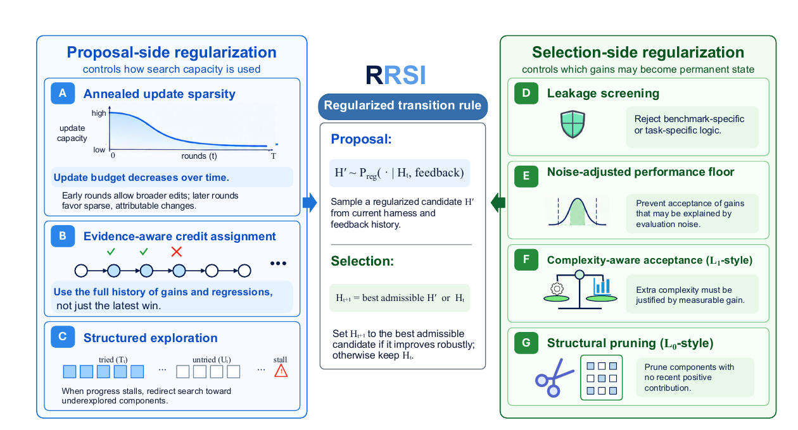

*Figure 2 · 原文 p.4 —— RRSI 总览。Proposal 侧（A–C）控制搜索容量怎么花：退火更新稀疏性、全历史信用分配、结构化探索；Selection 侧（D–G）控制哪些增益能固化为永久状态：泄漏筛查、噪声调整下限、复杂度准入（L2 式）、结构剪枝（L1 式）。*

RRSI 的立场是：不限制你能改什么——harness 的每个组件依然全开放——而是**正则化你在编辑空间里怎么走**。Figure 2 把七条正则分成两栏，并且明确类比了三种经典正则化，这个映射挺优雅，值得展开。

Proposal 侧三条，管的是搜索容量怎么花。第一，**退火更新稀疏性**：限制单个候选最多捆绑几个"独立可归因"的编辑，预算按 cosine 调度从 b_max 退火到 b_min——早期允许大改去发现新机制，后期强制稀疏、让每个改动可归因。这是 L0 式的基数约束，约束的是更新而不是参数向量。第二，**evidence-aware credit assignment**：每个被评估的候选都记录它改了哪个组件、检验什么假设、分数和成本怎么变、是否被接受；被拒的机制保留为负证据，防止搜索反复烧算力在已被证伪的假设上——这正是自适应数据分析里"每次评估都是又一次泄露"的直接对策。第三，**结构化探索**：当进度停在噪声带内超过 w 轮，强制把一小部分预算指向还没动过的组件，起的是熵正则的作用。

Selection 侧四条，管的是哪些增益能固化。**Leakage screening**：一个 critic 在评测之前读 diff，直接拒掉写死任务名、实体名、答案，或者加空转机器的编辑——注意在打分**之前**拦截很关键，否则泄漏候选会拿到虚高的 evolve 分数去污染后续提议。**Noise-adjusted floor**：进化前先反复测基线 harness，估出噪声带 δ，候选必须满足新分数不低于历史最优减 δ，防止搜索沿着一连串"小到像噪声的回退"走下坡。**复杂度准入**是 L2 式的：成本增幅必须被分数增幅证成，ΔC ≤ β0 + β1·ΔS，用 policy token 数做资源足迹的代理。**结构剪枝**是 L1 式的：连续窗口内没有正贡献的组件会被标记为删除目标，让保留下来的 harness 结构性变稀疏——机制必须持续"挣到自己的位置"，而不是因为只看分数的进化没有动力删它就一直活着。

### 实验：evolve 分最小，OOD 分唯一显著为正（13:00 – 15:00）

设置横跨三个域八个 benchmark：编码域在 Terminal-Bench 2.1 上进化、SWE-bench Verified 做 OOD；agentic workspace 在 Harvey LAB 上进化、JobBench、GDPval、APEX-Agents 做 OOD；工程设计在 EngDesign 上进化、Frontier-Eng 做 OOD——后者的判分是确定性模拟器，排除了 judge 套分的可能。backbone 全程冻结为 Claude Opus 4.8，对照四个最新的 harness 进化方法。

> **切图 · Figure 3 + Table 1（原文 p.8）**：Figure 3 扫一遍三个域；Table 1 重点讲排名反转：Meta-Harness evolve 最高但 OOD 平庸，RRSI evolve 最低却 OOD 全面领先。

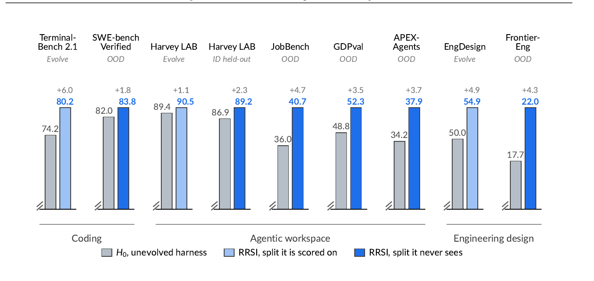

*Figure 3 · 原文 p.8 —— 三个域九个 split 的主结果：灰为未进化 H0，浅蓝为 RRSI 被打分的 split，深蓝为 RRSI 从未被评分的 split——所有深蓝柱均高于灰柱，即所有 held-out split 无一处回退。*

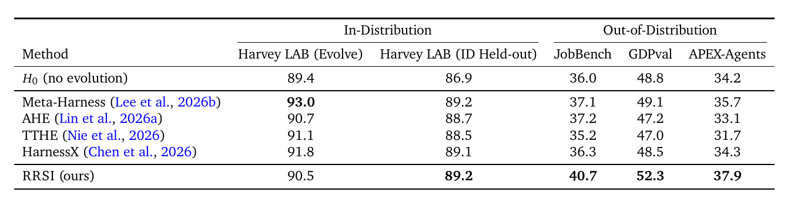

*Table 1 · 原文 p.8 —— agentic workspace 上与四个先前方法的对比：Meta-Harness 在 evolve split 拿最高 93.0，OOD 平均仅 +0.9；RRSI evolve 分最低（90.5），但 JobBench / GDPval / APEX-Agents 三个 OOD 基准全面领先。*

主结果一句话：**RRSI 在 evolve split 上的增益是所有方法里最小的，但它是唯一一个 OOD 平均分明显高过初始 harness 的**。agentic 三个 OOD 基准加 3.5 到 4.7 分，Frontier-Eng 相对提升 24.3%，没有任何一个 held-out split 回退。对照的四个 baseline，evolve 分都不错，一到 OOD 排名反转：Table 1 里 Meta-Harness evolve 拿 93.0 全场最高，OOD 平均只加 0.9 分；AHE 和 TTHE 收盘低于出发点；RRSI evolve 只有 90.5，OOD 平均 43.6 对初始的 39.7。这正是正则化被设计出来要做的那笔交易。

> **切图 · Table 2（原文 p.9）**：全篇最有说服力的一张表。突出最后一行与第一行对比：两侧正则都去掉 → evolve 全场最高、OOD 几乎归零、token 涨 57%。

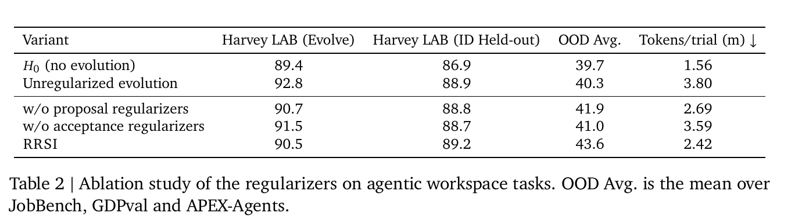

*Table 2 · 原文 p.9 —— 正则化消融：无约束进化的 evolve 分最高（92.8）但 OOD 平均 40.3、每 trial 3.80M tokens；RRSI evolve 90.5、OOD 43.6、2.42M tokens——evolve 分与真实泛化此消彼长。*

消融表把两侧正则各自拆掉看。去掉 acceptance 侧，evolve 分从 90.5 涨到 91.5，OOD 从 43.6 掉到 41.0，token 成本涨一半——说明无约束的选择规则把大部分接受花在了噪声和上下文堆积上。去掉 proposal 侧，evolve 只损失 0.2 分，OOD 却少 1.7 分——哪怕什么都不拒，"往哪看"本身就在起作用。两侧都去掉，evolve 拿全场最高的 92.8，OOD 只剩 40.3，几乎退回没进化过的水平，每 trial 380 万 token 对 RRSI 的 242 万。evolve 集分数和真实泛化反向，这张表是最直接的证据。

> **切图 · Table 3（原文 p.9）**：两个模型家族、一个从未参与搜索的弱 backbone，增益模式不变——说明学到的是机制不是拟合。

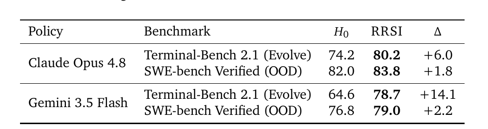

*Table 3 · 原文 p.9 —— 策略鲁棒性：Claude Opus 4.8 与 Gemini 3.5 Flash 两个家族独立进化，evolve 与 OOD 增益模式一致，且均是在从未被打分的 SWE-bench Verified 上拿到提升。*

两个鲁棒性实验值得一提。一是换模型家族：用 Gemini 3.5 Flash 独立跑一遍进化，Terminal-Bench 涨 14.1 分、SWE-bench Verified 涨 2.2 分，模式不变。二是把 Gemini 3.5 Flash 进化出的 harness 原封不动配给**从未参与搜索的** Gemini 3.1 Flash Lite，Terminal-Bench 从 11.2 提到 14.6，相对提升 30%——改出来的是可复用的机制，不是对某个 backbone 的拟合。成本上 Figure 4 还显示，四个 baseline 全部落在 RRSI 支配区域之外：花更多 token，换更低的 OOD 分。

### 局限（15:00 – 16:00）

作者自己列的局限有三条：只做 harness 层，权重全程冻结，没碰进化中更新权重的设定；方法依赖有限 evolve set 和一串正则超参——δ、β0、β1、退火调度都要在 evolve 集上定，效果受反馈信号质量制约；跨架构、跨工具生态、更长程的 RSI 还需要更广的验证。我补两点：leakage critic 和 proposer 都是同一个 LLM，它对"benchmark 特定"和"通用机制"的边界判断本身可能出错，误杀通用机制的代价论文没有量化；另外噪声带 δ 要靠额外反复评测基线来估，这笔开销在成本核算里没有单列。

---

## Part III · 放在一起看：两个正交的补丁，一个共同的软肋（16:00 – 18:00）

最后把两篇放到一张图上。层次上，Dream-RSI 改的是"探索如何分配"——发现过程之上的元策略；RRSI 改的是"系统如何修改自己"——harness 进化这个过程的动力学。但结构上它们做了一个相同的取舍：**都把 RSI 拆成"可优化的外层 + 冻结的内层"**。Dream-RSI 冻结 agent 和评测器，只让探索策略代码变；RRSI 冻结 backbone，只让 harness 变。这几乎等于承认：端到端的 RSI 目前不可控，可行的是圈出一个小的、可归因的优化对象，把它包在稳定的地基上。

对反馈信号的态度才是真正的分野。Dream-RSI 的问题是反馈太贵太慢，解法是造模拟器，把延迟反馈变成即时反馈；RRSI 的问题是反馈被滥用——有限评测集被自适应地反复查询——解法是正则化约束它怎么被消费。有意思的是，这两件事刚好互补。回想 Dream-RSI 的策略选择环节：M 个候选版本在同一批历史树上反复评估、择优部署——按 RRSI 的分析框架看，这正是坐在 adaptive overfitting 火上的操作，它需要一个 noise-adjusted floor。反过来，RRSI 的选择环节如果能借 Dream-RSI 式的模拟器做预筛，很多候选就不必烧真实评测。所以如果要我给一个 follow-up 方向：**把 RRSI 的正则化装进 Dream-RSI 的 replay 选择环节**——两边拼起来，才是一个更完整的 RSI 框架：既要反馈便宜，也要反馈不被用坏。

共同的软肋也很清楚：两篇都假设评测器足够便宜、且基本可信。Dream-RSI 的模拟器再快，也得先有人真金白银跑出那棵树；RRSI 的正则化再严，分数本身有偏就全白搭。评测质量，才是 RSI 这条路真正的地基。好，今天就到这里，欢迎大家讨论。

---

## 附：图文对照索引与时长

**演示切页顺序**：Dream-RSI — Figure 1 (p.2)、Figure 2 (p.4)、Figure 3 (p.8)、Table 1 (p.9)、Figure 4 (p.10)、Figure 6 (p.11)；RRSI — Figure 1 (p.2)、Figure 2 (p.4)、Figure 3 (p.8)、Table 1 (p.8)、Table 2 (p.9)、Table 3 (p.9)。Dream-RSI 的 Figure 5（语义引导消融，p.11）以口播带过，如需展示可从原文补页。

**时长**：合计约 18 分钟（开场 1' + Dream-RSI 8' + RRSI 7' + 合论 2'），按 230 字/分钟估算；压缩至 15 分钟的优先级：两段实验的数字细节 → 鲁棒性实验 → Figure 6 行为分析。

**图片文件对应**（与 Markdown 同目录的 `figs/` 下）：`drsi_fig1-02.png`、`drsi_fig2-04.png`、`drsi_fig3-08.png`、`drsi_tab1-09.png`、`drsi_fig4-10.png`、`drsi_fig6-11.png`、`rrsi_fig1-02.png`、`rrsi_fig2-04.png`、`rrsi_fig3-08.png`、`rrsi_tab1-08.png`、`rrsi_tab2-09.png`、`rrsi_tab3-09.png`。
