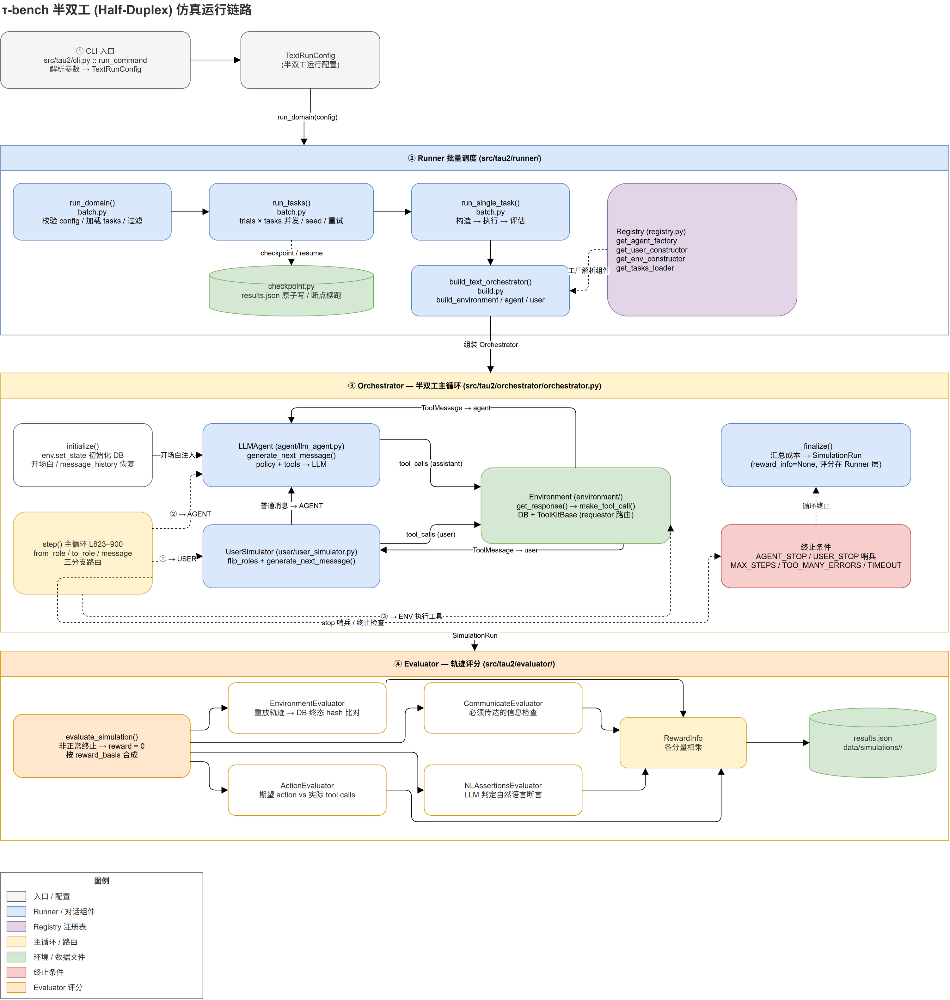

# τ-bench 框架分析与 Half-Duplex 模式完整链路

> 分析对象：`tau2-bench` 仓库 | 关注模式：**Half-Duplex（半双工、回合制）**

τ-bench 是一个对话式客服智能体评测框架。核心思想：**LLM Agent（客服）↔ LLM User Simulator（模拟用户）在一个由 DB + 工具构成的模拟环境中交互，轨迹结束后由 Evaluator 按 task 评分**。

## 0. 总览图



可编辑源文件：[`assets/half-duplex-architecture.drawio`](assets/half-duplex-architecture.drawio)（可用 draw.io 打开继续编辑）。

## 1. 总体架构

```
CLI (src/tau2/cli.py)
  → Runner (runner/batch.py, build.py, simulation.py)   批量调度 / 组件构造 / 执行
    → Registry (registry.py)                            组件解析（agent / user / domain / task）
    → Orchestrator (orchestrator/orchestrator.py)       回合制主循环
      ├── Agent   (agent/llm_agent.py)                  客服方
      ├── User    (user/user_simulator.py)              用户方
      └── Environment (environment/)                    DB + 工具执行
  → Evaluator (evaluator/)                              评分 → SimulationRun / results.json
```

## 2. Half-Duplex 完整链路

### ① 入口：CLI

`tau2 run` 由 `main()` 注册子命令，`run_command()` 闭包将参数（domain、agent-llm、user-llm、max_steps、并发数等）组装为 `TextRunConfig`（半双工专用配置，区别于全双工的 `VoiceRunConfig`），最终调用 `run_domain(config)`。

- `src/tau2/cli.py`：`add_run_args()`（L51–417）定义全部 CLI 参数；`run_command()`（L579–673）组装配置。

### ② Runner：批量调度与组件构造

| 组件 | 位置 | 职责 |
|------|------|------|
| `run_domain()` | `runner/batch.py` L836–894 | 校验 config → 加载 tasks → 过滤 → 确定 `data/simulations/<run_name>/results.json` 输出路径 |
| `run_tasks()` | `runner/batch.py` L454 | 按 `num_trials × num_tasks` 展开；seed 管理、线程池并发、重试 |
| `run_single_task()` | `runner/batch.py` L336–446 | 构造 Orchestrator → 执行 → 评估 → 可选 auto-review |
| `build_text_orchestrator()` | `runner/build.py` L326–404 | 依次 `build_environment()` → `build_agent()` → `build_user()` → 组装 `Orchestrator` |
| checkpoint | `runner/checkpoint.py` | `try_resume()` 校验 config hash 后断点续跑；`create_checkpoint_saver()` 用 tmp + `os.replace` 原子写 |

关键设计是 **Registry 模式**——所有组件都通过 `registry.py` 解析，框架代码不直接 import 具体实现：

```python
# runner/build.py（节选语义）
env_constructor = registry.get_env_constructor(domain)      # build_environment
agent_factory   = registry.get_agent_factory(agent_name)    # build_agent（传入 tools + policy）
user_ctor       = registry.get_user_constructor(user_name)  # build_user（传入 user_tools + scenario）
```

新增 domain / agent 只需在 `registry.py` 注册即可被 CLI 使用。

### ③ Orchestrator：半双工主循环（核心）

`Orchestrator`（`orchestrator/orchestrator.py` L350 起）继承 `BaseOrchestrator`，采用**模板方法**：

```python
# orchestrator/orchestrator.py L260–291
def run(self) -> SimulationRun:
    self.initialize()
    while not self.done:
        self.step()
        self._check_termination()
    return self._finalize()
```

**`initialize()`**（L483–666）：`environment.set_state()` 初始化 DB（含 `initialization_actions`）、设置随机种子；若有 `message_history` 则回放恢复双方状态，否则注入默认开场白。

**`step()`**（L823–900）是核心：用 `from_role / to_role / message` 三个路由状态实现三方交替，每个 step 是一次"消息传递"，共三个分支：

1. **AGENT/ENV → USER**：调 `user.generate_next_message()`；普通消息则下一步交给 Agent（`to_role=AGENT`），tool call 则交给 ENV，stop 哨兵则终止（`USER_STOP`）。
2. **USER/ENV → AGENT**：对称地调 `agent.generate_next_message()`；stop 哨兵触发 `AGENT_STOP`（solo 模式下 agent 产出非工具消息视为 `AGENT_ERROR`）。
3. **AGENT/USER → ENV**：`_execute_tool_calls()` 同步执行工具，结果包成 `MultiToolMessage` 回传给**原请求方**（`to_role=from_role`）——这就是半双工下"工具调用穿插在对话回合中"的实现方式。

**终止条件**（`_check_termination()` L734–750）：

| 类型 | 触发 |
|------|------|
| 正常 | `AGENT_STOP` / `USER_STOP`（`###STOP###`、`TRANSFER`、`OUT_OF_SCOPE` 哨兵） |
| 资源 | `MAX_STEPS` / `TOO_MANY_ERRORS` / `TIMEOUT` |
| 协议 | `AGENT_ERROR` / `USER_ERROR`（`validate_communication=True` 时检查通信协议违规） |

**`_finalize()`**（L752–821）：向双方发 stop 信号、汇总 LLM 成本，构建 `SimulationRun`（此时 `reward_info=None`，评分在 Runner 层完成）。

### ④ Agent 与 User 实现

两边对称：`HalfDuplex*` 基类 + 状态对象 + `generate_next_message(message, state)` 接口。

- **Agent**（`agent/llm_agent.py`）：`LLMAgent` 持有 `LLMAgentState`（system prompt + message 列表）；system prompt = 通用指令 + domain policy；`generate_next_message()`（L105）直接透传 LiteLLM（`utils/llm_utils.generate`）。变体：`LLMGTAgent`（带 resolution steps）、`LLMSoloAgent`（solo 模式，仅工具调用）。
- **User**（`user/user_simulator.py`）：`UserSimulator` 的 system prompt = 全局 simulation guidelines + persona + `<scenario>`（来自 task）。关键细节：调用 LLM 前做 `flip_roles()` **角色翻转**（让 simulator 以 assistant 视角生成"用户"发言），输出转成 `UserMessage`，其中 tool call 的 `requestor` 翻转为 `"user"`——保证 ENV 能把工具调用路由到 user 侧工具（`user_tools`）。

### ⑤ Environment：工具执行

- `Environment.get_response(tool_call)`（`environment/environment.py` L437–462）→ `make_tool_call()`（L158–185）按 `requestor` 分发到 agent 侧 `use_tool()` 或 user 侧 `use_user_tool()`；异常被捕获转为 `ToolMessage(error=True)` 而非崩溃。
- 工具由 `ToolKitBase` 子类声明（`environment/toolkit.py`）：`@is_tool` 装饰器标记 tool_type 与 `mutates_state`，元类自动收集，`get_tools()` 输出带 JSON schema 的定义供 LLM 使用。
- 每步后 `environment.sync_tools()` 同步状态；`set_state()`（L293–382）还会重放历史 mutating 调用并校验输出一致。

### ⑥ Evaluator：轨迹评分

`evaluate_simulation()`（`evaluator/evaluator.py` L85–333）是总分入口：

- **非正常终止**（非 AGENT_STOP / USER_STOP）直接 **reward = 0**。
- 半双工使用 4 个子评估器，按 `task.evaluation_criteria.reward_basis` 将各分量**相乘**：

| 评估器 | 校验内容 |
|--------|---------|
| `EnvironmentEvaluator` | 用全新环境重放轨迹中的 action，比对最终 DB hash + env assertions（数据库终态校验） |
| `ActionEvaluator` | 比对期望 action 序列与实际 tool calls |
| `CommunicateEvaluator` | 检查必须传达的信息 |
| `NLAssertionsEvaluator` | 用 LLM 判定自然语言断言 |

### ⑦ 数据模型

- `data_model/message.py`：`ToolCall`（含 `requestor: user|assistant`，路由依据）、`AssistantMessage` / `UserMessage` / `ToolMessage`（含 `error`）/ `MultiToolMessage`。
- `data_model/simulation.py`：`SimulationRun`（单次结果：messages、`termination_reason`、`reward_info`、成本）、`RewardInfo`（各分量 breakdown）、`Results`（批量结果 = checkpoint 文件）、`TextRunConfig`（半双工配置）。
- `data_model/tasks.py`：`Task` = user_scenario + initial_state + purpose + evaluation_criteria。

## 3. 一次完整调用时序

```
tau2 run
 → run_domain → run_tasks(并发 + checkpoint) → run_single_task
 → build_text_orchestrator: registry → Environment / LLMAgent / UserSimulator
 → Orchestrator.run():
     initialize: env.set_state + 默认开场白
     loop:
        user.generate_next_message    (AGENT → USER)
        agent.generate_next_message   (USER → AGENT)
        env.get_response(tool_calls)  (→ ENV, 结果回请求方)   [穿插进行]
        直到 stop 哨兵 / max_steps / 错误上限 / 超时
 → _finalize → SimulationRun
 → evaluate_simulation → RewardInfo (DB 终态 × Action × Communicate × NL)
 → 写入 data/simulations/<run_name>/results.json
```

## 4. 设计亮点

1. **Registry 解耦**：组件与框架通过注册表解耦，扩展新 domain / agent / user 只需注册，CLI 立即可用。
2. **统一的三方消息路由**：Orchestrator 用 `from_role / to_role` 路由状态统一了 agent / user / env 三方消息流；工具调用只是"对话中的一方暂时转向 ENV"，结果回传给原请求方。
3. **requestor + 角色翻转**：`ToolCall.requestor` 字段与 `UserSimulator.flip_roles()` 是半双工下区分两侧工具的关键机制。
4. **基于重放的客观评估**：评分以"重放到干净环境比对 DB 终态"为主，不依赖 LLM 主观判断（NL 断言除外），保证可复现性。
5. **工程化 Runner**：批量并发、seed 管理、checkpoint 原子写与断点续跑，适合大规模评测与 RL 实验。
