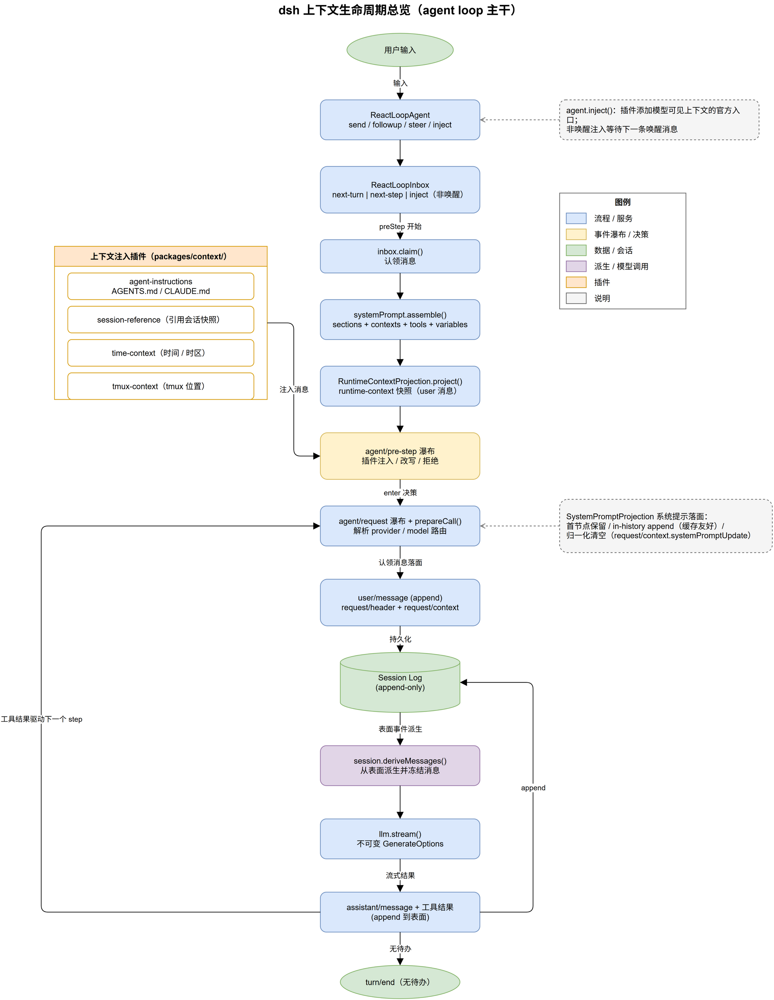
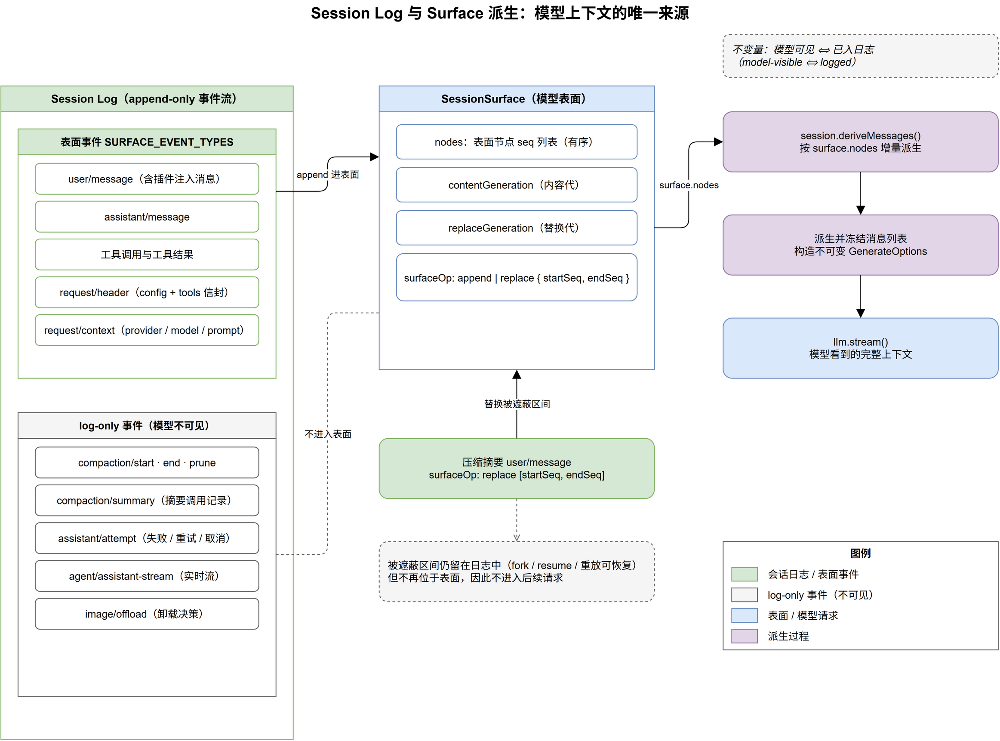
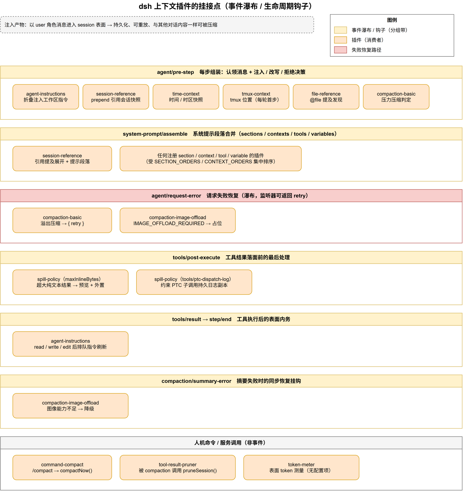
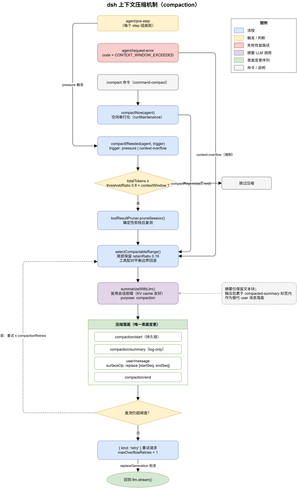

# dsh 上下文机制详解

适用版本：当前工作树。绘图：draw.io 31.1.8（WSL2 调宿主机二进制）。

目录：1 总览 · 2 组装流程 · 3 Log 与 Surface · 4 注入插件族 · 5 压缩机制 · 6 溢出存储 · 7 配置速查 · 8 图源文件

## 1. 总览：三层结构与两条不变量

dsh 的上下文系统分三层：

- **脊柱层**：`packages/core/agent-loop` 的 `ReactLoopAgent` 掌管 turn/step 节奏。
- **状态层**：`packages/core/session` 用 append-only 事件流记录一切，再派生出模型可见的"表面"。

- **能力层**：`packages/context/`、`packages/compaction/`、`packages/spill/` 等插件挂到事件瀑布上，负责注入、压缩、外置。

两条贯穿全局的不变量：

1. **模型可见 ⟺ 已入日志**：任何进入模型请求的内容都必须先作为事件写入 session log。
2. **表面是日志的投影**：模型收到的消息由 `session.deriveMessages()` 从表面派生并冻结，请求发出后不可变。

## 2. 上下文组装：从输入到冻结请求

一次 turn 的主干流程（对应 `packages/core/agent-loop/src/agent.ts`）：

1. **投喂**：`send()` / `followup()` / `steer()` / `inject()` 把消息放进 `ReactLoopInbox` 的队列（next-turn / next-step / inject）。`inject()` 是插件添加模型可见上下文的官方入口，非唤醒注入会等待下一条唤醒消息。
2. **preStep**：认领消息 → `systemPrompt.assemble()` → `RuntimeContextProjection.project()` → 派发 `agent/pre-step` 瀑布（插件在此注入、改写或拒绝）。

3. **step**：派发 `agent/request` 瀑布并调用 `prepareCall()` 解析 provider/model 路由；把本轮配置写入 `request/header`、`request/context` 事件。
4. **派发**：`buildRequest()` 调用 `session.deriveMessages()` 从表面派生消息，冻结为不可变 `GenerateOptions` 交给 `llm.stream()`。
5. **沉淀**：assistant 消息与工具结果 append 回日志；有工具结果则继续下一个 step，无待办则 `turn/end`。

## 3. Session Log 与 Surface：模型上下文的唯一来源

session 以 append-only 事件流存储，事件分为两类：

- **表面事件**（`SURFACE_EVENT_TYPES`）：`user/message`、`assistant/message`、工具调用与结果、`request/header`、`request/context`。它们构成 `SessionSurface`，是模型真正能看到的内容。
- **log-only 事件**：`compaction/start`、`compaction/summary`、`compaction/end`、`compaction/prune`、`assistant/attempt`、`agent/assistant-stream`、`image/offload` 等。它们只做记录与重放依据，不进入模型上下文。

表面的两种变更操作：

- `append`：常规追加（新消息、工具结果）。
- `replace { startSeq, endSeq }`：把一段区间整体替换为一个节点，压缩就是用它把阴影区间换成摘要。

`SessionSurface` 维护 `contentGeneration`（内容代）与 `replaceGeneration`（替换代）；`deriveMessages()` 按表面节点增量派生，请求发出后消息即冻结。被压缩遮蔽的事件仍留在日志中，可被 fork / resume / 重放恢复，但不再出现在后续请求里。

## 4. 注入插件族：packages/context/

`packages/context/` 下的插件统一在 `agent/pre-step` 以 **user 角色消息**注入上下文，因此产物持久、可重放、可压缩：

- **agent-instructions**：读取 `AGENTS.md` / `CLAUDE.md`（`maxBytes` 65536），折叠注入工作区指令；在 `tools/result` 检测到 read/write/edit 触碰指令文件后排队，于 `step/end` 刷新。
- **session-reference**：引用其他会话的只读快照，`referenceContextFraction` 0.2 约束预算；同时在 `system-prompt/assemble` 展开提及段落。

- **time-context**：注入当前时间 / 时区 / 经过时间快照。
- **tmux-context**：注入 agent 的 tmux 位置（每轮首步）。
- **file-reference** / **file-reference-local**：`@file` 提及发现与展开（发现服务本身不读文件内容）。

系统提示由 `packages/core/system-prompt` 的 `systemPrompt.assemble()` 合并 sections / contexts / tools / variables，并派发 `system-prompt/assemble` 瀑布；落面有三种策略：首节点保留、in-history append（缓存友好）、归一化清空（`request/context.systemPromptUpdate`）。

## 5. 压缩机制：packages/compaction/

`dsh-compaction` 服务提供 `compactIfNeeded()` / `compactNow()` / `compactRegion()`，`dsh-compaction-basic` 提供两条触发路径：

- **压力路径（pressure）**：每个 step 的 `agent/pre-step` 触发；`tokenMeter` 测量表面 token，达到 `thresholdRatio` 0.8 × `contextWindow` 才压缩。
- **溢出路径（context-overflow）**：`agent/request-error` 收到 `CONTEXT_WINDOW_EXCEEDED` 时，先 `toolResultPruner.pruneSession()` 确定性剪枝并复测，仍超则绕过阈值强制压缩一次，返回 `{ kind: 'retry' }` 重试（`maxOverflowRetries` 1）。

压缩的执行顺序：

1. `selectCompactableRange()` 选定区间，尾部保留 `retainRatio` 0.16，边界按工具调用/结果配对回退，避免拆散一对。
2. `summarizeWithLlm()` 生成摘要：复用会话前缀（KV cache 友好），`purpose: 'compaction'`，输出包裹于 `compacted-summary` 标签内，结构化 Markdown 检查点模板。
3. 落面序列是唯一的表面变更：`compaction/start`（持久锁）→ `compaction/summary`（log-only）→ `user/message` + `surfaceOp: replace [startSeq, endSeq]` → `compaction/end`。
4. 复测仍超阈值则重试，上限 `compactionRetries`（1）。

辅助插件：

- **tool-result-pruner**：head / middle / tail 剪枝（8192 / 4096 / 1024），被压缩流程调用 `pruneSession()`。
- **compaction-image-offload**：监听 `agent/request-error`（`IMAGE_OFFLOAD_REQUIRED`）与 `compaction/summary-error`，把图像卸载为占位。
- **command-compact**：`/compact` 命令 → `compactNow()`，在空闲时串行化执行（`runMaintenance`）。
- **token-meter**：重放感知的表面 token 测量服务。

## 6. 溢出存储：packages/spill/

大块内容不进模型上下文，而是外置到 spill 存储：

- **spill**：`SpillStore` 服务，写入外置内容并返回引用。
- **spill-local**：本地实现，目录权限 0700。
- **spill-policy**：挂在 `tools/post-execute`，按 `maxInlineBytes` 把超大工具结果截断为预览 + 外置引用；同时约束 `tools/ptc-dispatch-log` 的 PTC 子调用日志副本。

`packages/attachment/` 提供持久图像附件：它进入上下文，但本身不做上下文管理；超出路由能力时由 `compaction-image-offload` 处理。

## 7. 配置项速查

| 配置项 | 默认值 | 作用 | 位置 |
| --- | --- | --- | --- |
| `thresholdRatio` | 0.8 | 表面 token / contextWindow 的压力阈值 | packages/compaction/compaction-basic |
| `retainRatio` | 0.16 | 压缩区间选择时尾部保留比例 | 同上 |
| `compactionRetries` | 1 | 压缩后复测仍超阈值的重试次数 | 同上 |
| `maxOverflowRetries` | 1 | 上下文溢出后重试请求次数 | 同上 |
| `maxBytes` | 65536 | agent-instructions 读取指令文件上限 | packages/context/agent-instructions |

| `referenceContextFraction` | 0.2 | 引用会话快照占上下文的预算比例 | packages/context/session-reference |
| `maxInlineBytes` | 见预设 | 工具结果内联上限，超出外置为 spill | packages/spill/spill-policy |

组合方式见 `packages/preset/agent-presets/presets/standard/agent.cordis.yml` 与 `apps/cli/composition.md`（dsh-base 组合）。

---

## 8. 附：图源文件

| 图 | 源文件 | PNG |
| --- | --- | --- |
| 上下文生命周期总览 | `dsh-context-diagrams/context-lifecycle.drawio` | `context-lifecycle.png` |
| Session Log 与 Surface 派生 | `dsh-context-diagrams/session-surface.drawio` | `session-surface.png` |

| 插件挂接点 | `dsh-context-diagrams/injection-points.drawio` | `injection-points.png` |
| 压缩机制 | `dsh-context-diagrams/compaction.drawio` | `compaction.png` |

PNG 内嵌 draw.io XML，可直接拖回 draw.io 继续编辑。

