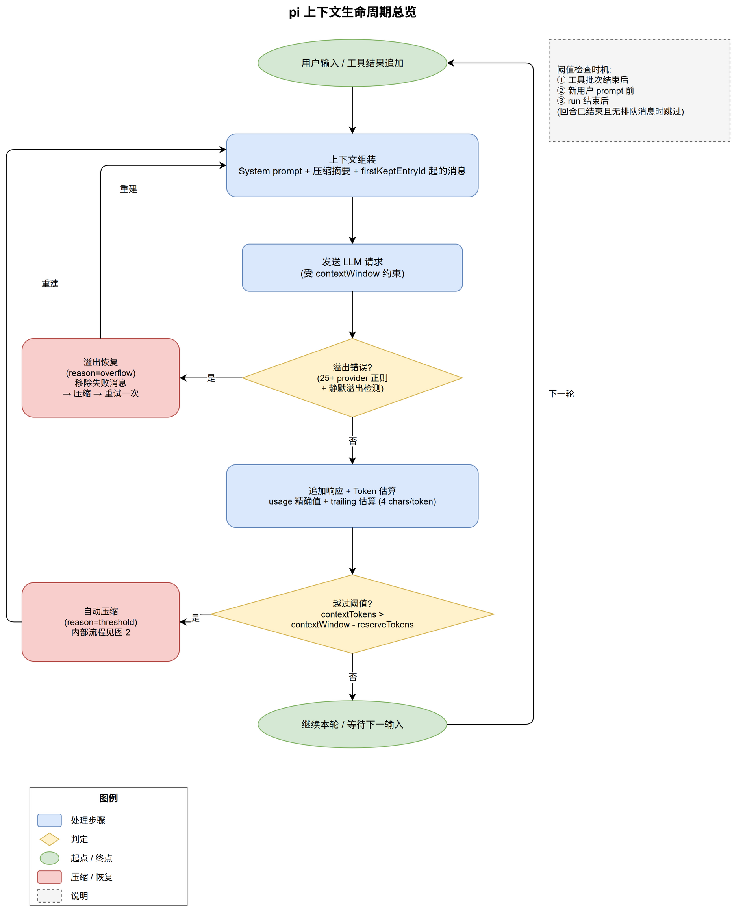
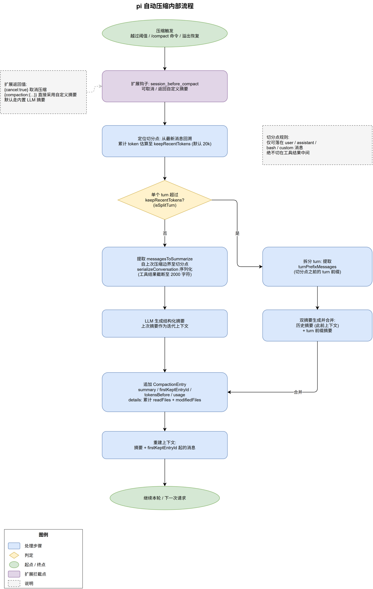
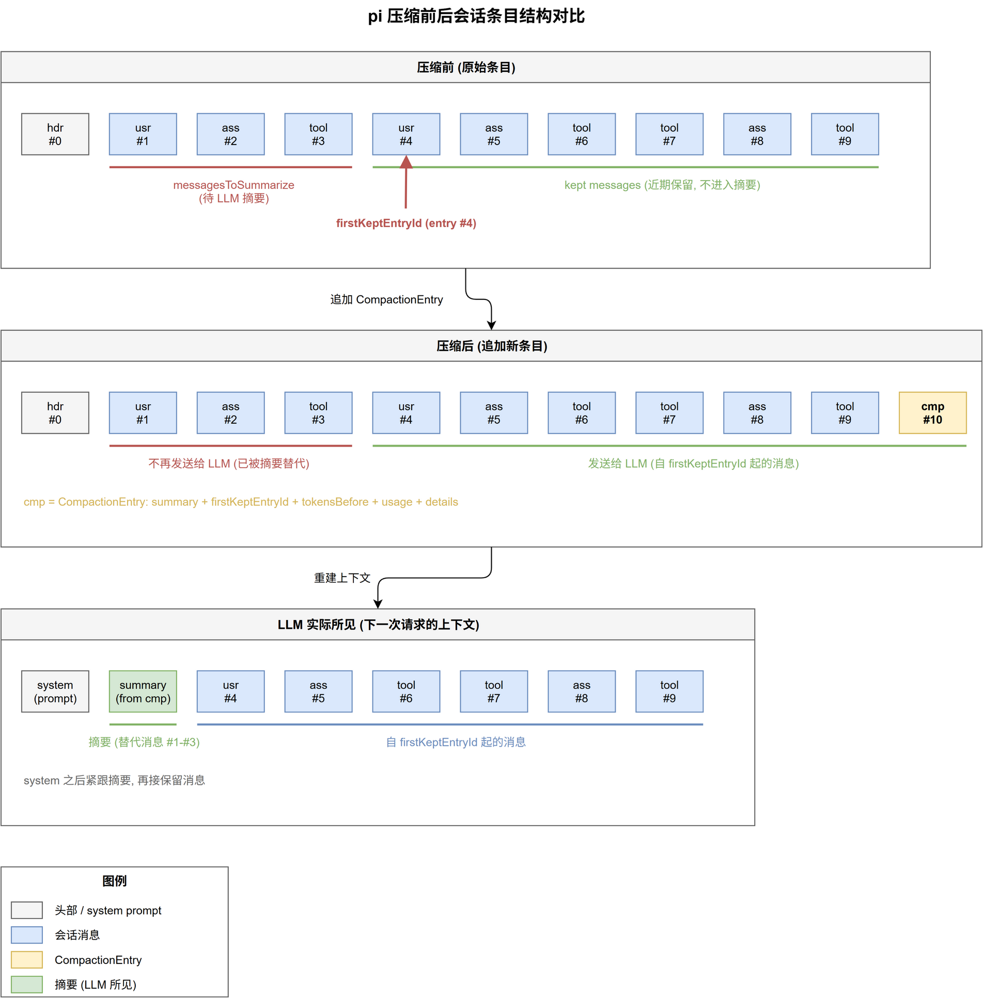

# pi 上下文机制详解

本文系统阐述 pi 编码代理的上下文管理机制：上下文如何组装、token 如何估算、自动压缩如何触发与执行、溢出如何恢复、分支切换时上下文如何延续，以及配置与扩展拦截点。所有数据均以仓库源码为准。

> 基于 pi 仓库 `main` 分支源码整理（涉及 `packages/coding-agent`、`packages/ai`）。

**源码索引**

| 机制 | 源码位置 |
|------|----------|
| 自动压缩 | `packages/coding-agent/src/core/compaction/compaction.ts` |
| 分支摘要 | `packages/coding-agent/src/core/compaction/branch-summarization.ts` |
| 序列化/文件跟踪 | `packages/coding-agent/src/core/compaction/utils.ts` |
| 触发判定与溢出恢复 | `packages/coding-agent/src/core/agent-session.ts` |
| Token 估算 | `packages/ai/src/utils/estimate.ts` |
| 溢出错误识别 | `packages/ai/src/utils/overflow.ts` |
| 扩展事件类型 | `packages/coding-agent/src/core/extensions/types.ts` |
| 官方机制文档 | `packages/coding-agent/docs/compaction.md` |

---

## 1. 上下文窗口与消息组装

pi 的会话以**条目树（SessionEntry tree）**形式持久化为 JSONL 文件（`~/.pi/agent/sessions/<编码后的项目路径>/*.jsonl`）。每个条目（用户消息、assistant 消息、工具结果、压缩条目等）通过 `parentId` 链构成一棵树，`/tree` 分支导航、`/resume` 恢复都基于这棵树。

发送给 LLM 的上下文由三部分组装而成：

1. **System prompt**：内置基础提示 + 项目资源（`AGENTS.md`、追加提示等）
2. **压缩摘要**（若发生过压缩）：最近一次 `CompactionEntry` 的 `summary`
3. **保留消息**：自 `firstKeptEntryId` 起的原始消息序列（用户 / assistant / 工具调用与结果）

完整生命周期如下图：上下文组装 → 请求 → 响应与 usage 反馈 → 阈值判定 → 压缩或溢出恢复，循环往复。



---

## 2. Token 估算机制

pi 需要随时知道当前上下文占用，以决定是否触发压缩。估算实现在 `packages/ai/src/utils/estimate.ts`，采用**混合策略**：

**精确部分（usage-based）**：取最后一条有效的 assistant 消息所报告的 usage：

```typescript
// packages/ai/src/utils/estimate.ts:18
export function calculateContextTokens(usage: Usage): number {
    return usage.totalTokens || usage.input + usage.output + usage.cacheRead + usage.cacheWrite;
}
```

有效性判断（`estimate.ts:71`）排除 `stopReason` 为 `aborted` / `error` 的响应，且要求该响应之后没有被插入更新的前缀消息（例如压缩摘要），否则 usage 不能描述当前前缀。

**估算部分（trailing）**：usage 之后新增的消息按字符数折算：

- 文本与工具调用参数：`字符数 / 4`（`CHARS_PER_TOKEN = 4`，`estimate.ts:15`）
- 图片内容：每张按 4800 字符折算（`ESTIMATED_IMAGE_CHARS`）
- system 消息额外计入新增/移除的工具定义

两者相加得到 `ContextUsageEstimate { tokens, usageTokens, trailingTokens, lastUsageIndex }`（`estimate.ts:97`）。若会话尚无任何有效 usage（例如全部响应失败），则退化为纯字符估算。

> 兜底：当最后一条消息是错误响应或 usage 全零时（如持续 529 错误），pi 会基于上一次有效响应推算，保证 token 计数不被错误响应重置。

扩展与 TUI 看到的 `ContextUsage { tokens, contextWindow, percent }`（`extensions/types.ts:290`）即来自这套估算。

---

## 3. 自动压缩触发条件与检查时机

**触发公式**（`compaction.ts:250`）：

```typescript
export function shouldCompact(contextTokens: number, contextWindow: number, settings: CompactionSettings): boolean {
    if (!settings.enabled) return false;
    return contextTokens > contextWindow - settings.reserveTokens;
}
```

即：**当前上下文 tokens 越过 `contextWindow - reserveTokens` 即触发**。`reserveTokens` 为 LLM 响应预留空间（默认 16384），同时影响摘要生成的输出上限（被模型 max output tokens 封顶）。

**三个检查时机**（`agent-session.ts:557` 等）：

1. 工具批次结束、结果追加之后、下一次 assistant 响应之前（agent run 内）
2. 新用户 prompt 提交之前
3. 底层 agent run 结束之后

其中时机 1 在“回合已终止且无排队消息”时跳过，避免无意义的压缩。

**配置**（`~/.pi/agent/settings.json` 或 `<project-dir>/.pi/settings.json`）：

```json
{
  "compaction": {
    "enabled": true,
    "reserveTokens": 16384,
    "keepRecentTokens": 20000,
    "modelOverrides": {
      "anthropic/claude-sonnet-4-5": { "reserveTokens": 100000 }
    }
  }
}
```

- `reserveTokens`：为响应预留的 tokens，**调大它 = 提前触发压缩**（测试时最常用的手段）
- `keepRecentTokens`：压缩时保留的近期消息 tokens（默认 20000）
- `modelOverrides`：按 `provider/modelId` 精确覆盖（键区分大小写），每个字段独立回退：模型覆盖值 → 普通设置值 → 内置默认值
- `"enabled": false` 关闭自动压缩，但仍可用 `/compact` 手动触发

---

## 4. 压缩内部流程

压缩由 `prepareCompaction()`（切分点计算）与 `compact()`（摘要生成与落盘）完成，内部流程如下：



**① 定位切分点**：从最新消息向前回溯，累计 token 估算直至达到 `keepRecentTokens`（默认 20k），该位置即切分点。合法切分点仅限：用户消息、assistant 消息、BashExecution、custom/branch_summary 消息——**绝不切在工具结果中间**（工具结果必须与其调用保持在一起）。

**② Split turn（拆分回合）**：正常情况下压缩在“回合边界”切分（一个 turn = 用户消息 + 其后续所有 assistant/工具消息）。当**单个 turn 自身超过 `keepRecentTokens`** 时，切分点落在 turn 中间的 assistant 消息上，此时：

- `isSplitTurn = true`，`messagesToSummarize = []`（无完整 turn 可摘要）
- `turnPrefixMessages` = turn 开头到切分点之间的消息
- pi 生成**两个摘要并合并**：历史摘要（此前上下文，若有）+ turn 前缀摘要

**③ 序列化**：`serializeConversation()` 把消息转为带角色标记的纯文本（`[User]:` / `[Assistant]:` / `[Assistant tool calls]:` / `[Tool result]:`），防止模型把摘要请求当作对话续写。工具结果截断至 2000 字符，超出部分以截断标记替代——工具输出（尤其 `read`/`bash`）通常是上下文的最大来源。

**④ 生成摘要**：调用 LLM 产出结构化摘要（Goal / Constraints / Progress / Key Decisions / Next Steps / Critical Context + `<read-files>` / `<modified-files>` 标签）。若存在上次压缩摘要，则作为**迭代上下文**传入，实现多轮压缩的信息累积。请求使用独立的路由 session ID，且在受支持时禁用 prompt-cache 写入（一次性请求无复用价值）。

**⑤ 追加条目**：写入 `CompactionEntry`（结构见第 7 节）。文件操作跟踪是**累计的**：本次从被摘要消息的工具调用中提取，并与上次压缩/分支摘要的 `details` 合并，因此多次压缩后仍保留完整读写文件历史。落盘前还会基于重建后的上下文重算 `tokensBefore`，确保反映真实的压缩前占用。

**⑥ 重建上下文**：下次请求的上下文 = system prompt + 新摘要 + 自 `firstKeptEntryId` 起的保留消息。

---

## 5. 溢出恢复

阈值检查是“事前防御”，但请求仍可能因判断偏差或模型行为差异而**实际溢出**。溢出识别在 `packages/ai/src/utils/overflow.ts:37`，维护 25+ 个 provider 特定的错误正则：

| Provider | 溢出特征 |
|----------|----------|
| Anthropic | `prompt is too long: N tokens > M maximum`、HTTP 413 `request_too_large` |
| OpenAI 系列 | `exceeds the context window`、`maximum context length` |
| Google | `input token count ... exceeds the maximum` |
| OpenRouter / Groq / xAI / Ollama 等 | 各自的错误措辞 |
| 通用兜底 | `too many tokens` / `token limit exceeded` / `context_length_exceeded` |

两类特殊情况单独处理：

- **z.ai**：不报错、静默接受溢出 → 通过 `usage.input > contextWindow` 检测
- **Xiaomi MiMo**：静默截断输入并返回 `finish_reason=length` 且零输出 → 通过 “length + 零输出 + 输入恰好填满窗口” 检测

限流类错误（`rate limit`、`too many requests` 等）被显式排除，不会误判为溢出（`overflow.ts:74`）。

确认溢出后，`_checkCompaction()`（`agent-session.ts:2185` 起）区分三种路径：

1. **overflow + retry**：请求中途溢出或可恢复的 length 停止 → 移除失败的 assistant 消息 → 压缩（`reason=overflow`）→ **重试本轮一次**（`_overflowRecoveryAttempted` 防止无限重试）
2. **overflow + preserve**：响应已成功完成但超出窗口 → 仅压缩，不重试（`agent.continue()` 无法从已完成响应继续）
3. **threshold**：正常响应后估算值越过阈值 → 压缩，不重试

---

## 6. 分支摘要（Branch Summarization）

使用 `/tree` 切换到历史分支时，pi 提供对被离开分支的摘要，把上下文带入新分支：

1. **找公共祖先**：新旧位置最深共享节点
2. **收集条目**：从旧叶子回溯至公共祖先
3. **带预算准备**：按 token 预算从最新往回包含消息
4. **生成摘要**：与压缩相同的结构化格式
5. **落盘**：在导航点追加 `BranchSummaryEntry`（含 `fromId` 指向被离开的叶子）

```
         ┌─ B ─ C ─ D (旧叶子, 被离开)
    A ───┤
         └─ E ─ F (目标) ─ [B,C,D 的摘要] (新叶子)
```

文件跟踪同样与压缩共享累计机制。

---

## 7. CompactionEntry 结构与会话重建

```typescript
interface CompactionEntry<T = unknown> {
  type: "compaction";
  id: string;
  parentId: string;
  timestamp: number;
  summary: string;           // 生成的结构化摘要
  firstKeptEntryId: string;  // 保留消息的起始条目
  tokensBefore: number;      // 压缩前上下文 tokens（落盘前重算）
  usage?: Usage;             // 生成摘要所耗 LLM usage（计入会话总消耗）
  fromHook?: boolean;        // true 表示由扩展提供（历史字段名）
  details?: T;               // 默认实现: { readFiles, modifiedFiles }
}
```

`details` 对扩展开放，可存放任意可 JSON 序列化的自定义数据。

**会话重建与 LLM 视角**：压缩不删除任何历史条目，只是追加一个 `cmp` 条目并改变上下文的组装方式——被摘要区间的消息不再发送，LLM 实际看到的是 `system + summary + 保留消息`：



**多次压缩的边界衔接**：再次压缩时，摘要区间从**上次压缩的保留边界**（`firstKeptEntryId`）开始而非从 `cmp` 条目开始（找不到时回退到上次压缩条目的下一条）。这意味着上次幸存的保留消息也会被纳入本次摘要，避免信息盲区。

---

## 8. 配置与扩展拦截

### 8.1 扩展拦截点

| 扩展点 | 时机 | 能力 |
|--------|------|------|
| `session_before_compact` | 自动/手动压缩准备完成后 | `event.preparation` 提供切分明细（`messagesToSummarize`、`turnPrefixMessages`、`tokensBefore`、`firstKeptEntryId`、`settings` 等）；可返回 `{ cancel: true }` 取消，或返回 `{ compaction: { summary, firstKeptEntryId, tokensBefore, usage?, details? } }` 完全替换摘要（可用 `serializeConversation(convertToLlm(...))` 自行序列化后交给任意模型） |
| `session_compact_failed` | 压缩失败/中止 | 携带 `reason` / `errorMessage` / `aborted` / `willRetry` / `fromExtension`，用于配对观测 |
| `session_before_tree` | `/tree` 导航前 | 可取消导航，或替换分支摘要 |
| `ctx.compact(options)` | 任意扩展逻辑中 | 程序化触发压缩（`onComplete` / `onError` 回调） |
| `ctx.getContextUsage()` | 任意扩展逻辑中 | 读取当前 `ContextUsage` |

`reason` 字段区分三种触发来源：`manual`（`/compact`）、`threshold`（阈值）、`overflow`（溢出恢复）。

### 8.2 实践：测试压缩行为

官方示例 `packages/coding-agent/examples/extensions/trigger-compact.ts` 演示了不依赖 settings 的**自定义阈值**触发：在 `turn_end` 中比较 `ctx.getContextUsage().tokens` 与自定阈值，越线即调用 `ctx.compact()`——与模型窗口大小无关，适合跨模型测试。

一个最小可用的测试环境（项目级，放于 `<project>/.pi/` 下）：

```
<project>/.pi/settings.json    # 降低阈值: 调大 reserveTokens, 调小 keepRecentTokens
<project>/.pi/extensions/compaction-observer.ts   # 观测扩展
```

观测扩展订阅三个事件即可看到压缩全过程：`turn_end` 记录每轮 token 占用、`session_before_compact` 记录触发原因与切分明细、`session_compact_failed` 记录失败，并可注册命令调用 `ctx.compact()` 手动触发。

**运行时观察手段**：

- TUI 压缩进行时显示 `Auto-compacting... (esc to cancel)` 状态条（Esc 可中止），压缩原因（manual/overflow）不同提示不同
- 扩展事件写入日志文件，可观察 token 从越线到压缩后骤降（接近 `keepRecentTokens` + 摘要大小）的完整轨迹
- 会话 JSONL 中 `grep '"type":"compaction"'` 可直接查看每次压缩的 `tokensBefore`、`summary` 全文与 `firstKeptEntryId`，用于检验摘要质量
- 功能性验证：压缩前埋入对话“锚点”（如暗号），压缩后询问该细节，能答对说明摘要保留了关键信息，答错的部分即压缩的信息损失

### 8.3 要点小结

- 阈值 = `contextWindow - reserveTokens`，**改 `reserveTokens` 即改触发点，无需改源码**
- `keepRecentTokens` 决定保留量，须显著小于触发点，否则几乎全部内容被摘要
- `reserveTokens` 兼具摘要输出上限语义（受模型 max output 封顶），按模型用 `modelOverrides` 精确调优
- 压缩是无损持久化（追加式），损失只发生在“摘要替代原始消息”的 LLM 视角层面
